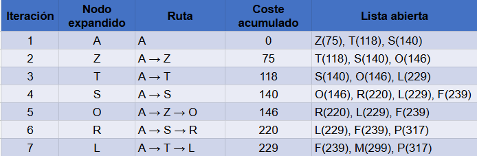

# ALGORITMOS DE BÚSQUEDA EN GRAFOS

## Descripción
  Este proyecto tiene como finalidad estudiar y comparar varios algoritmos de búsqueda en grafos mediante su aplicación a un problema de navegación similar al sistema de los GPS.  
  A través de distintas estrategias de búsqueda, se analiza cómo cada algoritmo encuentra una ruta entre dos ciudades y cómo se comporta en cuanto al coste total del camino, el número de nodos generados y visitados,y también el tiempo necesario para obtener la solución.

## Objetivos
  Con este trabajo queremos conseguir:
  - Implementar algoritmos de búsqueda no informada y de búsqueda informada, permitiendo observar sus diferencias y aplicaciones en un mismo contexto.
  - Modelar el problema de búsqueda mediante grafos.
  - Comparar el rendimiento y comportamiento de los resultados obtenidos por cada algoritmo, al resolver el mismo problema.
  - Analizar métricas como son el coste total del camino encontrado, los nodos generados y visitados durante la búsqueda, además de la eficiencia de cada método.

## Algoritmos utilizados
  Los algoritmos desarrollados y evaluados en este proyecto son:
  - Búsqueda en Amplitud (Breadth-First Search, BFS)
  - Búsqueda en Profundidad (Depth-First Search, DFS)
  - Branch & Bound (búsqueda por coste uniforme)
  - A* (Branch & Bound con heurística), este mejora la eficiencia a la hora de la exploración del espacio de búsqueda.

## Estructura de datos utilizadas
  El proyecto hace uso de varias estructuras de datos fundamentales para la implementación de los algoritmos de búsqueda:

### Cola FIFO (First-In, First-Out)
  Son estructuras de datos en las que el primer elemento en entrar es el primero en salir. Se utilizan habitualmente en algoritmos como la búsqueda en amplitud, ya que permiten explorar los nodos por niveles, respetando el orden en el que fueron generados.  
  Un ejemplo de esto es:
```
from utils import FIFOQueue
cola = FIFOQueue()
cola.append('A')
cola.append('B')
print(cola.pop())  # Salida: 'A'
```

### Pila (Last-In, First-Out, LIFO)
  Aquí el último elemento añadido es el primero en extraerse. Esta estructura es característica de la búsqueda en profundidad, ya que favorece la exploración de un camino hasta el final antes de retroceder.  
  Ejemplo:
```
from utils import Stack
pila = Stack()
pila.append('A')
pila.append('B')
print(pila.pop())  # Salida: 'B'
```

### Cola de prioridad
  Se almacenan los elementos ordenados según un criterio de prioridad asociada. Siempre se extrae el elemento con mayor prioridad, lo que resulta fundamental en algoritmos como Branch & Bound y A*, donde se selecciona el nodo más prometedor en cada paso.  
  Un ejemplo sería:
```
from utils import PriorityQueue
pq = PriorityQueue(f=lambda x: x)  # menor valor = mayor prioridad
pq.append(5)
pq.append(2)
pq.append(8)
print(pq.pop())  # Salida: 2
```


## Estructura del repositorio
```
  ├── utils.py  # Funciones auxiliares y estructuras de datos.
  ├── search.py # Implementación de problemas, nodos y algoritmos de búsqueda.
  ├── run.py    # Script principal de la ejecución y comparación.
  └── README.md # Documentación del proyecto, es decir, explicación del desarrollo de este.
```

## Descripción de los diferentes archivos

### utils.py
  Este archivo contiene un conjunto de funciones y estructuras de apoyo utilizadas por el resto del proyecto. En el cual, se implementan distintas estructuras de datos, como son en este caso: colas FIFO, pilas y colas de prioridad. Necesarias para el funcionamiento de los algoritmos de búsqueda.  
  Además, incluye funciones matemáticas y estadísticas, junto con utilidades para el manejo de listas, vectores y diccionarios.  
  En resumen, este archivo actúa como una base general sobre la que se construyen e implementan los distintos algoritmos de búsqueda del proyecto.

### search.py
  Este implementa el núcleo del sistema de búsqueda:
  - Clase Problem: clase abstracta que establece establece la estructura básica de cualquier problema de búsqueda.
  - Clase Node: encargada de representar los nodos del árbol de exploración junto con la información necesaria para reconstruir la solución.  
  
  A partir de estas clases se implementan los siguiente algoritmos de búsqueda:
  - BFS
  - DFS
  - Branch & Bound
  - A*

  Además se incorporan la **clase Graph** y derivados para representar grafos dirigidos y no dirigidos. Asimismo, se define la **clase GPSProblem**, la cual modela un problema de navegación entre ciudades.  
  En nuestro caso la clase Graph se vería de la siguiente forma:
  ```
class Graph:
    def __init__(self, dict=None, directed=True):
        self.dict = dict or {}
        self.directed = directed
        if not directed:
            self.make_undirected()

    def make_undirected(self):
        """Make a digraph into an undirected graph by adding symmetric edges."""
        for a in list(self.dict.keys()):
            for (b, distance) in list(self.dict[a].items()):
                self.connect1(b, a, distance)

    def connect(self, A, B, distance=1):
        """Add a link from A and B of given distance, and also add the inverse
        link if the graph is undirected."""
        self.connect1(A, B, distance)
        if not self.directed: self.connect1(B, A, distance)

    def connect1(self, A, B, distance):
        """Add a link from A to B of given distance, in one direction only."""
        self.dict.setdefault(A, {})[B] = distance

    def get(self, a, b=None):
        """Return a link distance or a dict of {node: distance} entries.
        .get(a,b) returns the distance or None;
        .get(a) returns a dict of {node: distance} entries, possibly {}."""
        links = self.dict.setdefault(a, {})
        if b is None:
            return links
        else:
            return links.get(b)

    def nodes(self):
        """Return a list of nodes in the graph."""
        return list(self.dict.keys())
  ```

  Y la clase GPSProblem se vería así:
  ```
  class GPSProblem(Problem):
    """The problem of searching in a graph from one node to another."""

    def __init__(self, initial, goal, graph):
        Problem.__init__(self, initial, goal)
        self.graph = graph

    def successor(self, A):
        """Return a list of (action, result) pairs."""
        return [(B, B) for B in list(self.graph.get(A).keys())]

    def path_cost(self, cost_so_far, A, action, B):
        return cost_so_far + (self.graph.get(A, B) or infinity)

    def h(self, node):
        """h function is straight-line distance from a node's state to goal."""
        locs = getattr(self.graph, 'locations', None)
        if locs:
            return int(distance(locs[node.state], locs[self.goal]))
        else:
            return infinity
```
  Finalmente, se incluyen contadores globales para registrar el número de nodos generados y visitados durante la ejecución de cada algoritmo, facilitando así el análisis de su rendimiento.

### run.py
  Y por último estaría este archivo principal de ejecución del proyecto. Se encarga de:
  - Inicializar el problema de búsqueda (mapa de Rumanía).
  - Ejecutar cada algoritmo de búsqueda.
  
  Durante la ejecución se recogen y muestran por pantalla los resultados obtenidos:
  - Ruta encontrada
  - Coste total del camino
  - Nº nodos generados
  - Nº nodos visitados
  - Tiempo de ejecución
  
  Este archivo permite comparar fácilmente el comportamiento y eficiencia de los distintos algoritmos.

## Ejecución del programa

### Ejecución
  Desde la raíz del proyecto se ejecutaría:
   ```bash
   python run.py
   ```
  Y esto lo que hace es mostrará por consola los resultados de cada algoritmo.

### Ejemplo de la salida
  Ahora pongo un ejemplo de como se vería la salida de este programa, este ejemplo pertenece al primer caso de origen **Arad** y destino **Bucharest** y especificamente al algoritmo de búsqueda en Amplitud
```
  ===  BFS  ===
  Generados: 21
  Visitados: 16
  Costo total: 450
  Ruta: [<Node B>, <Node F>, <Node S>, <Node A>]
  Tiempo: 0.1893 ms
```
  Cada algoritmo produce métricas distintas, lo que permite analizar su eficiencia y optimalidad. Una cosa a tener en cuenta es que cada vez que lo ejecutes el tiempo irá variando.

## Conclusiones
  La búsqueda en amplitud (BFS) asegura que se encontrará la solución más cercana a la raíz del árbol de búsqueda, aunque no siempre será la de menor coste. Por su parte, la búsqueda en profundidad (DFS) suele ser eficiente en cuanto al uso de memoria, pero no garantiza obtener una solución óptima. Luego el algoritmo Branch & Bound permite encontrar la ruta de menor coste entre el estado inicial y el objetivo. Finalmente, A* mejora el rendimiento de Branch & Bound al incorporar una heurística admisible, lo que guía la búsqueda de manera más eficiente hacia la solución.

## Vista de la tabla completada
  Para este rabajo había que rellenar una tabla la cual era la comparación de estrategias de búsqueda, y aquí la adjunto aunque esta subida al repositorio:  
  

## IMPLEMENTACIÓN MANUAL DE LA: Búsqueda por Ramificación y Acotación en el grafo de Rumanía
  En esta primera parte opcional se ha llevado a cabo una simulación manual de una búsqueda sobre el grafo de Rumanía utilizando la estrategia de Ramificación y Acotación. El objetivo de este ejercicio es comprender y mostrar de forma clara cómo funciona el algoritmo, siguiendo su ejecución paso a paso.  
  La búsqueda comienza en el nodo A (Arad) y, en cada iteración, se selecciona para su expansión el nodo cuyo camino desde el origen presenta el menor coste acumulado. De esta manera, el algoritmo prioriza siempre las rutas más económicas en términos de distancia recorrida.

### Estrategia
  La estrategia de Ramificación y Acotación se apoya en una serie de reglas que guían el proceso de búsqueda.  
  En primer lugar, se mantiene una lista abierta, que es la lista de nodos pendientes de explorar, la cual se ordenada según el coste acumulado de cada ruta. En cada iteración se selecciona para su expansión el nodo que presenta el menor coste dentro de esta lista. Al expandirlo, se generan sus nodos sucesores y la lista abierta se actualiza incorporando estos nuevos caminos, manteniendo siempre el orden por coste.  
  Para evitar recorridos innecesarios, no se permiten ciclos, de modo que un mismo nodo no puede aparecer dos veces dentro de una misma ruta. Además, si se alcanza un nodo por distintos caminos, solo se conserva aquel que tiene el coste más bajo, descartando los recorridos alternativos que resultan más costosos.  
  Esta estrategia hace que la busqueda sea más eficiente.

### Como se desarrollo
  El proceso de búsqueda se ha llevado a cabo de manera iterativa.  
  Se parte del nodo inicial A, al que se le asigna un coste acumulado inicial de 0. A partir de ahí, en cada iteración se sigue siempre el mismo procedimiento.  
  En primer lugar, se selecciona de la lista abierta el nodo cuyo coste acumulado es menor. Este nodo se expande generando sus sucesores, y para cada uno de ellos se calcula el nuevo coste acumulado del camino desde el origen. Con esta información, la lista abierta se actualiza incorporando los nuevos nodos y manteniéndose ordenada según el coste.  
  Este proceso se repite a lo largo de siete iteraciones, en nuestro caso, aplicando en todo momento los principios de ramificación y acotación descritos anteriormente.  

  La tabla obtenida recoge, para cada iteración, el nodo que ha sido expandido, la ruta seguida hasta alcanzarlo, el coste acumulado asociado a dicha ruta y el estado de la lista abierta una vez realizada la expansión.

### Vista de la solución
  A continuación se muestra la tabla con el desarrollo completo de 7 iteraciones de la búsqueda por Ramificación y Acotación:  
  

## Autor
**Trabajo realizado por:** Sara Dévora Ortega  
**Asignatura:** Fundamentos de los Sistemas Inteligentes (FSI)  
**Universidad:** Universidad de Las Palmas de Gran Canaria (ULPGC)  
**Curso académico:** 2025/2026  


